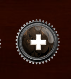
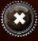

## Ticket to Ride - Manual(Group 06)

### Starting the Game
#### Playing Local
To play local choose the button labeled "solo" after starting the game.
To add a player click the  button. 
To remove a player click the  button. 
Set the player's AI using the  button.
In order to start the game, all player must have non-empty unique names.
#### Playing an online game
To Play on online game click the button labeled "online" after starting the game.
Now you can either host a game by clicking on "create a game" or join a game by clicking on "join a game"
#### Hosting a game
    

## Playing the Game

### Choosing the starting destination cards
When the game starts, each player is required to choose 2 to 5 destination cards. To do this, he needs to click on the
cards he wants and then press the button on the bottom right.

### Showing the cards
To cycle through the hand cards, the arrows besides the destination and wagon cards can be used. By pressing the 
"Show Cards" button the other players cards can be looked at. To return to your own cards, press the 
"Show your own cards" button in the bottom.

### Drawing wagon cards
To draw wagon cards, click on one of the open wagon cards on the right of the screen. Alternatively the covert draw pile
can be chosen. After choosing the first card, it is no longer possible to perform any action besides drawing a second
card.

### Drawing destination cards
To draw new destination cards, click on the destination card pile on the top right of the screen. Then, 3 cards will be
shown of which at least one has to be chosen by clicking on it. To confirm the selection, click on the button on the 
bottom right.

### Claiming routes
To claim a route, first choose the wagon cards needed. This is done by clicking on the cards. It might be necessary to 
cycle through the cards with the arrow buttons. After choosing the cards, click on the route. When it is not possible
to claim the route with the selected cards, an error message will be displayed and another route or different cards 
can be selected.
For tunnels, after the initial selection, a prompt will appear asking for 0 to 3 additional cards. They can be chosen
and then confirmed by pressing the button on the bottom right.

### Undo and Redo
The arrow buttons on the bottom right can be used to un- and redo turns. This option is disabled when playing online.

## End of the game
When the game is over, the resulting points will be shown together with the placement of the players.
Then either a new game can be started, the same game can be restarted or the game can be exited.